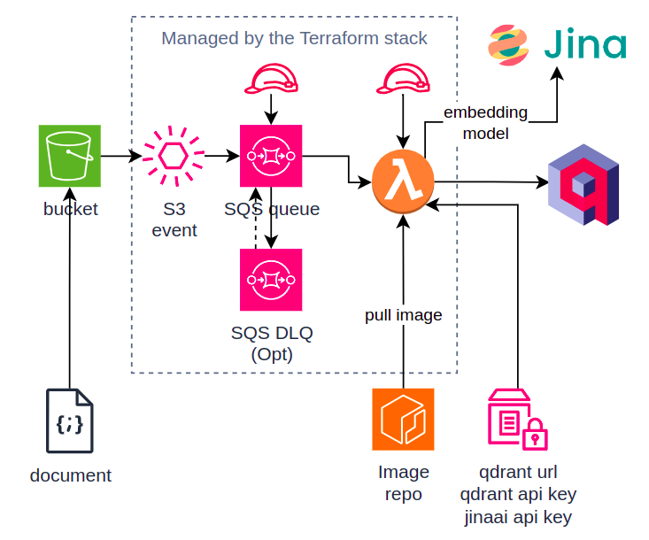

## Terraform Serverless Vector Ingestion

Transform your documents and ingest them into Qdrant using  



## Quickstart

Prerequisites: 

 * `awscli` installed
 * `terraform` installed.
 * `docker` installed.
 * Access to AWS and permissions.
   If you have a profile configured, and wish to make it default, add `AWS_PROFILE=...` to the `.env`.
 * A Qdrant cluster deployed. If you don't have any, create one for free on their [website](https://cloud.qdrant.io/login). Keep at hand it the URL and API key. 
 * A JinaAI API Key. If you don't, grab one for free from their [webpage](https://jina.ai/). Keep the API key close.


1. Create a ECR repo:
```bash

make aws/ecr/login && \
make aws/ecr/create TARGET=qdrant-ingestion
```
2. Build the Docker images.
```bash
make docker/build TARGET=qdrant-ingestion
```
3. Push the Docker image to the ECR repo 
```bash
make docker/push TARGET=qdrant-ingestion
```
4. Create the following secure SSM Parameters:
```bash
aws ssm put-parameter \
    --name "/vectorized/qdrant/ecr/image" \
    --value <ACCOUNT_ID>.dkr.ecr.<REGION>.amazonaws.com/qdrant-ingestion:latest \
    --type "SecureString" \
    --description "ECR iamge for Qdrant ingestor in lambda"

aws ssm put-parameter \
    --name "/vectorized/qdrant/url" \
    --value "<QDRANT_URL>" \
    --type "SecureString" \
    --description "Qdrant URL"

aws ssm put-parameter \
    --name "/vectorized/qdrant/apikey" \
    --value "QDRANT_API_KEY" \
    --type "SecureString" \
    --description "Qdrant API Key"

aws ssm put-parameter \
    --name "/vectorized/jina/apikey" \
    --value "<JINA_API_KEY>" \
    --type "SecureString" \
    --description "Jina AI API Key"
```
5. Initialize the terraform stack. Follow one of the two options below.
   A. Store TFState locally.
```bash
    make tf/init TARGET=app ENV=sandbox
```
   B. Store TFState in S3 and Lock in Dynamo.
    a. Create a bucket in S3 to store the State
```
aws s3 mb s3://<your-tf-state-bucket>
```
    b. [Optional] Create a dynamodb table (on demand) to store the lock
```
aws dynamodb create-table \
    --table-name <your-tf-lock-dbtable> \
    --attribute-definitions \
        AttributeName=LockID,AttributeType=S \
    --key-schema \
        AttributeName=LockID,KeyType=HASH \
    --table-class ON_DEMAND
```
    c. Create a file the `./environments/sandbox/app/backend.conf` and write:
```
bucket="s3://<your-tf-state-bucket>"
key="<path/to>/terraform.tfstate"
region="<your-bucket-region>"
dynamodb_table="<your-tf-lock-dbtable>"
```
    d. Uncoment lines 8-15 of `deployments/app/versions.tf`
```bash
    make tf/init TARGET=app ENV=sandbox
```
6. Create one more secret to store a UUID namespace. More about this in the [section](#uuid-namespace) below.
```
aws ssm put-parameter \
    --name "/vector-ingestion/qdrant/namespace" \
    --value $(uuidgen) \
    --type "SecureString" \
    --description "Namespace UUID4 to ensure key consistency and avoid duplication in Qdrant"
```
7. Create a `terraform.tfvars` file in `environments/sandbox/app/` using `template.terraform.tfvars` as reference. Fill with your values.

8. Deploy:
```
make tf/deploy TARGET=app ENV=sandbox
```
9. Test your deployment. Drop a file in your S3 bucket. After a moment, check your Qdrant database, 
   you should find the vectorized document's chunks there.

10. [Opt] Clean up. 
```
aws s3 rm s3://<documents-bucket>/ --recursive
make tf/destroy TARGET=app ENV=sandbox 
aws ecr --repository-name <value> --force 
aws dynamodb delete-table --table-name <your-tf-lock-dbtable> 
aws s3 rm s3://bucket-name/doc --recursive
aws s3 rb s3://<your-tf-state-bucket>
aws ssm delete-parameter --name "/vectorized/qdrant/ecr/image"
aws ssm delete-parameter --name "/vectorized/qdrant/url"
aws ssm delete-parameter --name "/vectorized/qdrant/apikey"
aws ssm delete-parameter --name "/vectorized/jina/apikey"
aws ssm delete-parameter --name "/vectorized/qdrant/namespace"
```

## Note: Namespace

There is a chance that sometime a document is processed twice. If there is no control over
how the ID is created, the same chunk created by two different lambdas would have a different ID.

For that we use a [namespace](https://stackoverflow.com/questions/10867405/generating-v5-uuid-what-is-name-and-namespace).

Setting a namespace, we can ensure getting the same consistent UUID for a two identical document chunks.


Eg: 
```python
from uuid import uuid4, uuid5

text = "hello world"

namespace = uuid4()
id1 = uuid5(namespace, text)
id2 = uuid5(namespace, text)

assert id1 == id2
```

## TODO: 

  * [ ] Test clean up logic.
  * [ ] Improve docs for lambda logic.